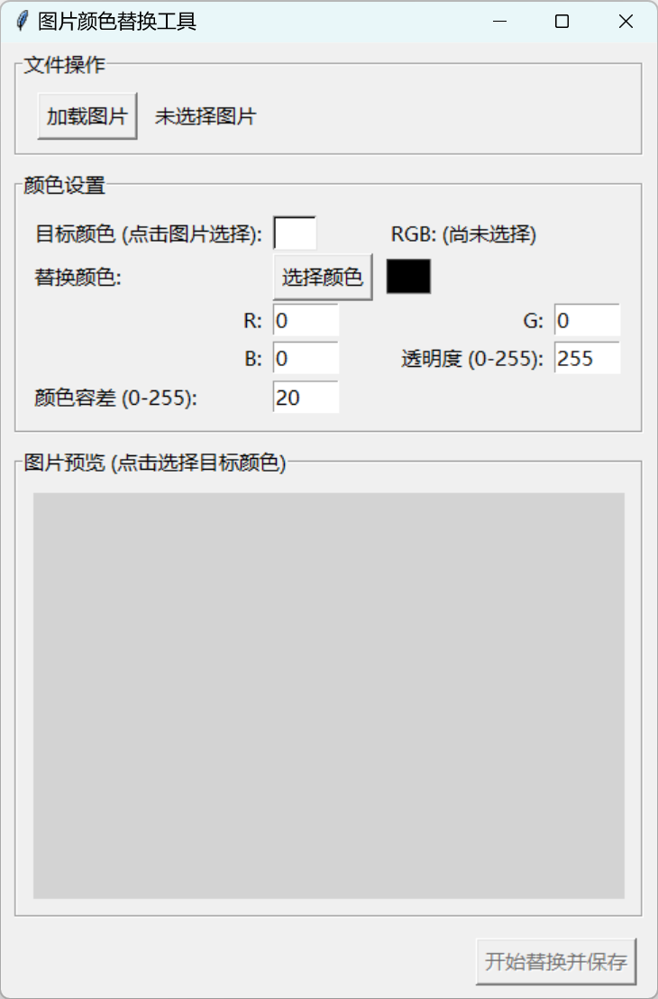

# Python 图片颜色替换工具
一款基于 Python 和 Tkinter 的图像颜色替换 GUI 工具，支持用户通过点击图片选取目标颜色，并将其替换为自定义颜色或设为透明。


## ✨ 功能特性
图形用户界面 (GUI)：易于操作的界面，无需命令行知识。

图片预览: 加载并显示待处理的图片。

点击拾色: 直接在图片预览上点击选择要替换的目标颜色。

### 自定义替换颜色:

通过 RGB 输入框和 Alpha 输入框 (0-255) 设置替换颜色。

支持通过标准颜色选择器选取替换颜色的 RGB 部分。

可将目标颜色替换为完全透明 (Alpha = 0)。

颜色容差: 可调节的容差值 (0-255)，用于匹配与目标颜色相近的颜色。

多种图片格式支持: 支持加载多种常用图片格式 (如 JPEG, PNG, GIF, BMP, TIFF, WebP 等)。

输出保存: 将处理后的图片保存为 PNG 文件 (推荐，以良好支持透明度)。

## 🛠️ 环境要求
Python 3.x

Pillow (PIL Fork) 库

你也可以直接下载release

### ⚙️ 安装依赖
在运行脚本之前，您需要安装 Pillow 库。打开您的终端或命令行，然后运行：

```bash
pip install Pillow
```

### 🚀 如何运行
确保您已安装 Python (3.x版本) 和 Pillow 库。

将项目代码下载到您的本地计算机。

打开终端或命令行，使用 cd 命令导航到脚本所在的目录。

运行以下命令启动程序：
```bash
python main.py
```

### 📖 使用说明
加载图片:

点击程序界面左上角的【加载图片】按钮。

在弹出的文件对话框中选择您想要处理的图片文件。

图片加载成功后会在下方的预览区域显示。

选择目标颜色:

在图片预览区域，用鼠标左键点击您想要替换掉的颜色部分。

所选颜色会实时显示在“目标颜色”旁边的预览小方块和 RGB 值标签中。

设置替换颜色:

手动输入: 在“替换颜色”区域的 R, G, B, Alpha (0-255, 默认255不透明, 其中 Alpha=0 表示完全透明, Alpha=255 表示完全不透明) 输入框中填入期望的数值。

颜色选择器: 点击 R, G, B 输入框旁边的【选择颜色】按钮，会弹出一个颜色选择对话框，您可以在其中选取替换颜色的 RGB 部分。Alpha 值仍需在对应的输入框中手动调整。

替换颜色的 RGB 预览小方块会根据您输入的 R, G, B 值实时更新。

设置颜色容差:

在“颜色容差 (0-255)”输入框中填入一个0到255之间的整数值 (程序默认值为 20)。

容差值决定了颜色匹配的宽松程度。值越大，与目标颜色越“相似”的颜色也会被一并替换。例如，容差为 0 表示仅替换与目标颜色RGB值完全相同的像素。

开始替换并保存:

完成以上设置后，点击程序界面右下角的【开始替换并保存】按钮。

在弹出的文件对话框中选择处理后图片的保存路径和文件名。强烈建议使用 .png 作为文件扩展名，以确保透明效果能够正确保存。

处理完成后，程序会弹出操作成功的提示信息。

### 📸 示例截图
<br>
处理前：<br>
<br>
处理后：
<table>
  <tr>
    <td align="center" valign="top">
      
      <br/>
      <em>颜色替换成黑色</em>
    </td>
    <td align="center" valign="top">
      
      <br/>
      <em>颜色更改成透明</em>
    </td>
  </tr>
</table>
