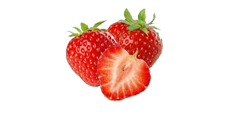
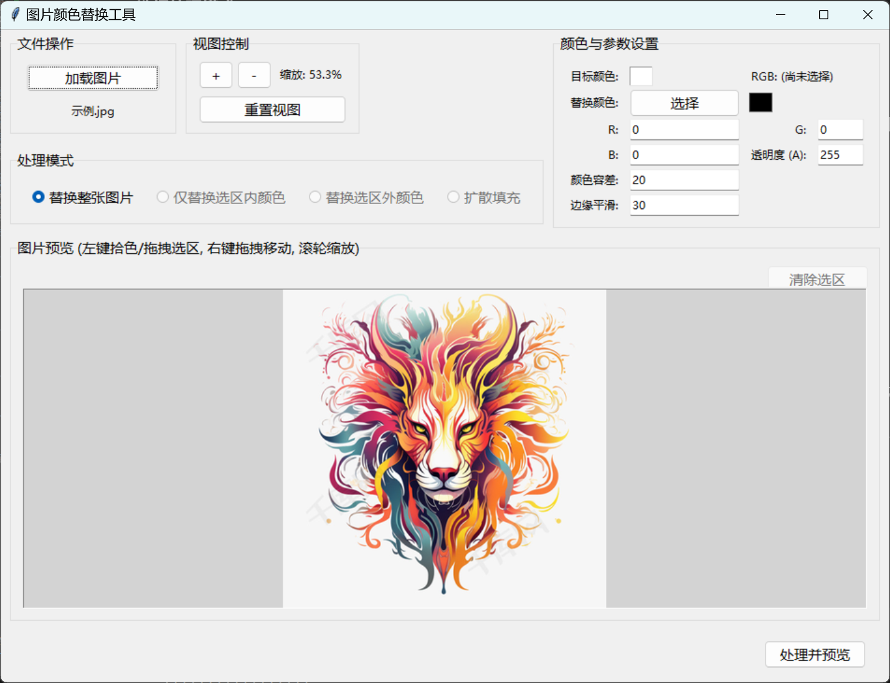
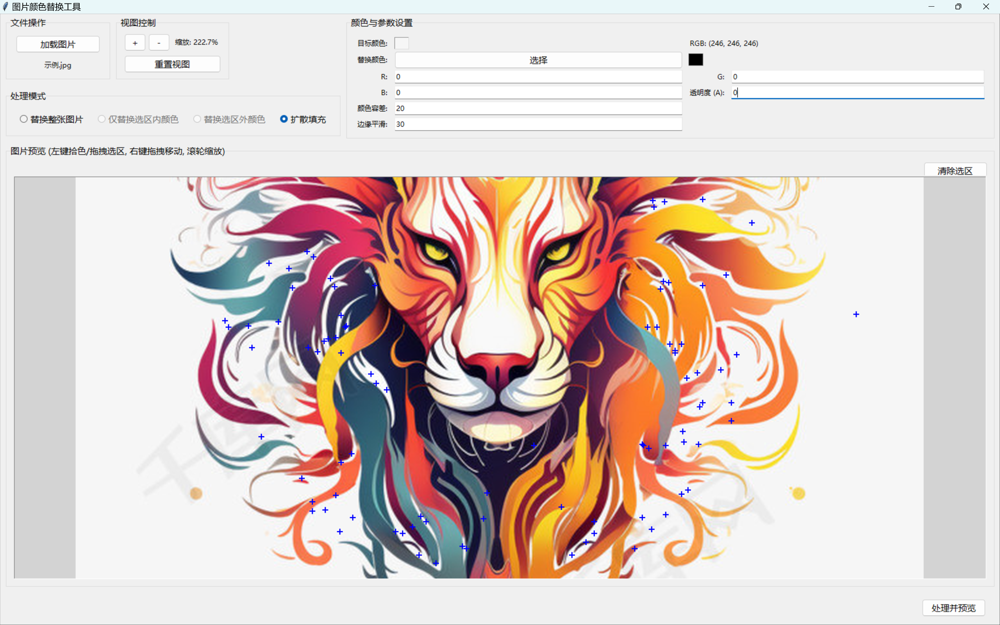
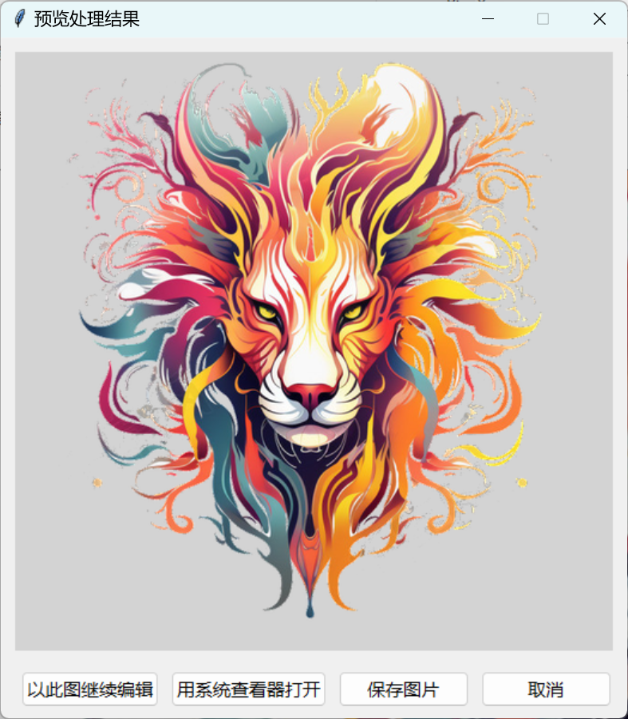

<div align="center">

# Python 图片颜色替换工具
### A GUI Tool for Image Color Replacement


</div>

一款基于 Python 和 Tkinter 的图像颜色替换 GUI 工具，支持用户通过点击图片选取目标颜色，并将其替换为自定义颜色或设为透明。

可以轻松实现 **替换背景**、**一键抠图**（对纯色背景尤其好用）、**去除水印**，以及各种对图片特定颜色的替换或删除操作。

## 📸 运行效果

一个抠图的例子：将图片中的白色背景替换为透明背景，同时去除图片水印。

<table>
  <tr>
    <td align="center"><strong>原图</strong></td>
    <td align="center"><strong>处理后效果</strong></td>
  </tr>
  <tr>
    <td></td>
    <td></td>
  </tr>
</table>

<details>
<summary><strong>👉 点击查看更多处理效果示例</strong></summary>

| 功能 | 效果图 |
| :--- | :--- |
| **边缘平滑 (Feathering)** |  |
| **基础抠图 (Matting)** |  |
| **去除水印 (Watermark Removal)** |  |

<table>
  <tr>
    <td align="center"><strong>原图</strong></td>
    <td align="center"><strong>消除效果</strong></td>
  </tr>
  <tr>
    <td></td>
    <td></td>
  </tr>
  <tr>
    <td align="center"><strong>原图</strong></td>
    <td align="center"><strong>换色效果</strong></td>
  </tr>
  <tr>
    <td></td>
    <td></td>
  </tr>
  <tr>
    <td align="center"><strong>原图</strong></td>
    <td align="center"><strong>抠图效果</strong></td>
  </tr>
  <tr>
    <td></td>
    <td></td>
  </tr>
</table>
</details>

<br>

## ✨ 如何使用？

### 🚀 三种使用方式

- **方式一 (推荐)**：使用已打包好的文件。请在项目主页右侧的 **Releases** 中下载最新的 Windows 可执行版本，[下载exe](https://github.com/WinriseF/Color-replacement/releases)，下载后直接运行，无需安装。

- **方式二**：使用网页版。直接访问项目提供的 HTML 文件即可在浏览器中运行。
  > **注意**：由于网页环境限制，网页版仅支持基础的颜色替换，无法使用“选区”、“扩散填充”等高级功能。

- **方式三 (适合开发者)**：通过源代码运行。

<details>
<summary>👉 点击展开 “通过源代码运行” 的说明</summary>

#### 🛠️ 环境要求
- Python 3.x
- Pillow 库

#### ⚙️ 安装依赖
在运行脚本之前，您需要安装 Pillow 库。打开您的终端或命令行，然后运行：

```bash
pip install Pillow
```

#### 🚀 运行程序
1.  将项目代码下载到您的本地计算机。
2.  打开终端或命令行，使用 `cd` 命令导航到 `main.py` 所在的目录。
3.  运行以下命令启动程序：
    ```bash
    python main.py
    ```
</details>

<br>

## 📖 使用说明

1.  **加载图片**:
    -   点击程序界面左上角的 **【加载图片】** 按钮。
    -   在弹出的文件对话框中选择您想要处理的图片文件。
    -   图片加载成功后会在下方的预览区域显示。

2.  **选择目标颜色**:
    -   在图片预览区域，用 **鼠标左键** 点击您想要替换掉的颜色部分。
    -   所选颜色会实时显示在“目标颜色”旁边的预览小方块和 RGB 值标签中。

3.  **选择处理模式**:
    -   **替换整张图片**: 默认模式，对整张图片中所有符合条件的颜色进行替换。
    -   **仅替换选区内颜色**: 先用鼠标左键拖拽出一个矩形选区，程序将只替换选区内的颜色。
    -   **替换选区外颜色**: 与上一条相反，保留选区内，替换选区外的颜色。
    -   **扩散填充**: 类似魔棒工具。先点选一个目标颜色，然后切换到此模式，程序会从您之前点选的位置开始向外扩散替换颜色，类似于水流从点击位置流满整个相关颜色区域，在这个模式下可以进行多次点击让区域颜色进行替换。
    - 下图是进行抠图示例：先点击图片空白处设置目标颜色，然后透明度设置为0，然后选择扩散填充，将图片主体中不与外界接触的“独立”区域打上标签，设置平滑度（一般120左右就可以了，不要超过164），然后处理并预览（你可以选择不保存，图片文件缓存会在系统的临时文件夹temp中，退出程序自动清理）
    
    

4.  **设置替换颜色**:
    -   **手动输入**: 在“替换颜色”区域的 `R`, `G`, `B`, `A` 输入框中填入期望的数值 (0-255)。
        - `Alpha=0` 表示完全透明 (用于抠图)。
        - `Alpha=255` 表示完全不透明，默认为255。
    -   **颜色选择器**: 点击 **【选择】** 按钮，会弹出一个颜色选择对话框，方便地选取替换颜色的 RGB 部分。

5.  **设置参数**:
    -   **颜色容差**: 决定颜色匹配的宽松程度。值越大，与目标颜色越“相似”的颜色也会被一并替换；例如我先点击颜色为红色，设置为20那么酒红色等与红色差异较小的颜色也被替换，设置为80的话那么长得像红色的甚至其它颜色都被替换。
    -   **边缘平滑**: 替换区域的边缘与原图的过渡平滑度。值越大，边缘越模糊柔和，可以有效避免“锯齿感”。

6.  **处理并保存**:
    -   完成以上设置后，点击程序界面右下角的 **【处理并预览】** 按钮。
    -   在弹出的预览窗口中确认效果。
    -   点击预览窗口中的 **【保存图片】** 按钮，选择保存路径和文件名。
    -   也可以以当前图片继续创作。
    -   > **强烈建议**：如果使用了透明效果，请务必以 `.png` 作为文件扩展名保存。


## 📄 许可证

该项目采用 [MIT](https://opensource.org/licenses/MIT) 许可证。
